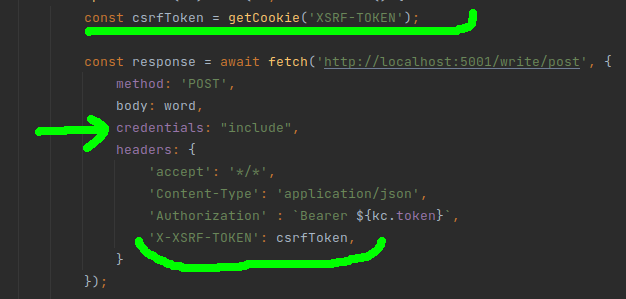
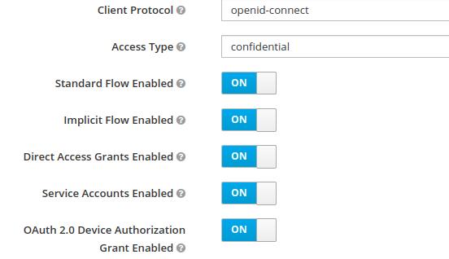

### Explicações sobre o CSRF

* O ***gateway*** foi configurado com a seguinte configuração no arquivo *SecurityConfig.java*:

* Com essa configuração do ***csrf***, é necessário enviar os *cookies* da sessão e o token csrf
em todas as requisições HTTP que modificam o estado dos dados do *backend* (PATCH, POST, PUT e DELETE):

* É necessário configurar o ***cors*** do *gateway*, no arquivo *SecurityConfig.java*, para permitir o envio dos *cookies* da sessão:

* Para incluir estes *cookies* na requisição, pode-se usar o jQuery.ajax ou 
se usar ***fetch***, deve-se incluir o parâmetro ***credentials: 'include'***.
* Também é necessário enviar o ***token csrf*** no *header* das requisições:

* Para usar o ***Swagger***, basta a seguinte configuração no arquivo *application.yml* do serviço que possui o método **POST**:

Funcionamento do ***Swagger***:

Funcionamento do ***frontend Svelte***:

## Instruções gerais de execução:

* Entre em cada subdiretorio: 'read' e 'write' executando o seguinte comando dentro de cada um:

***mvn package -Dmaven.test.skip***

* Depois, volte ao diretorio raiz "poc-cors" e execute o seguinte comando:

***docker-compose up -d --build***

* Terminado tudo sem erros, acesse com um browser a configuração do Keycloack em:

***http://localhost:8080/auth/admin/***

user: admin 
pass: admin

Crie um Realm chamado "my" e crie um usuário com senha para prosseguir com os testes:

Crie também um 'client' com as seguintes propriedades:

Valid Redirect URIs = *

Web Origins = *

Clique no botão 'Save'.

Após colocar 'Access Type' = 'Confidential', aprerecerá a guia 'Credentials', nela 
em 'Client Authenticator' escolha 'Client Id and Secret', gere e copie o 'secret'.

Com esse secret você pode cola-lo na tela de login do Swagger:

ou cola-lo no arquivo 'application.yml' dos serviços 'read' e 'write' e refazer os dois primeiros passos.

* Execute o ***"gateway"*** separadamente, por exemplo pela IDE;

* Depois acesse com um browser as páginas do Swagger para realizar os testes:

***Pelo GateWay:***

***http://localhost:5001/read/swagger-ui.html***
***http://localhost:5001/write/swagger-ui.html***

***Sem passar pelo Gateway:***

***http://localhost:3001/read/swagger-ui.html***
***http://localhost:3002/write/swagger-ui.html***

## Funcionamento do 'cors'

Cada serviço tem sua própria configuração de ***cors*** e funcionam em conjunto:

* *FilterChain* do Gateway:

* *Application.yml* do Gateway:

* Writeservice:

* ReadService:

* Keycloack:

Neste caso, foram liberados todos os acessos no ***gateway*** e no ***Keycloack*** e restringido o ***"cors"*** somente nos serviços **read** 
e **write**.

## Usando o svelte

* Crie no Keycloak um cliente "svelte" com acesso público:

* No diretório ***vite-svelte*** execute: 

***npm run dev***

* Abra o navegador para testar a aplicação (o gateway e o docker-compose devem estar rodando também):

http://localhost:5173/

## Explicações sobre o ***CORS***

* No ***CORS***, a porta ***5001*** foi liberada para permitir que se possa acessar o swagger pelo ***gateway***.
* No *application.yml* do *Gateway*, o ***cors*** tem **precedência** sobre o ***cors*** do *httpSecurity*, e funciona mesmo desabilitando o ***CORS*** lá no *httpSecurity*.
* Tanto os cors do gateway, quanto dos seviços devem estar habilitados e configurados para se evitar que o navegador bloqueie o javascript de acessá-los.
* É preciso se adicionar o *filter* no *application.yml* do ***gateway***: ***DedupeResponseHeader=Access-Control-Allow-Origin*** para remover o ***header duplicado*** *(um gerado pelo gateway e outro pelo serviço)*, porque os navegadores tambem bloqueiam se tiver mais de um ***Origin*** e também bloqueiam se não tiver.
* Sem o ***cors*** **configurado**, o navegador também **bloqueia por padrão** o ***header 'Content-Type': 'application/json'*** e o *preflight request* com o *httpMethod Options*:

